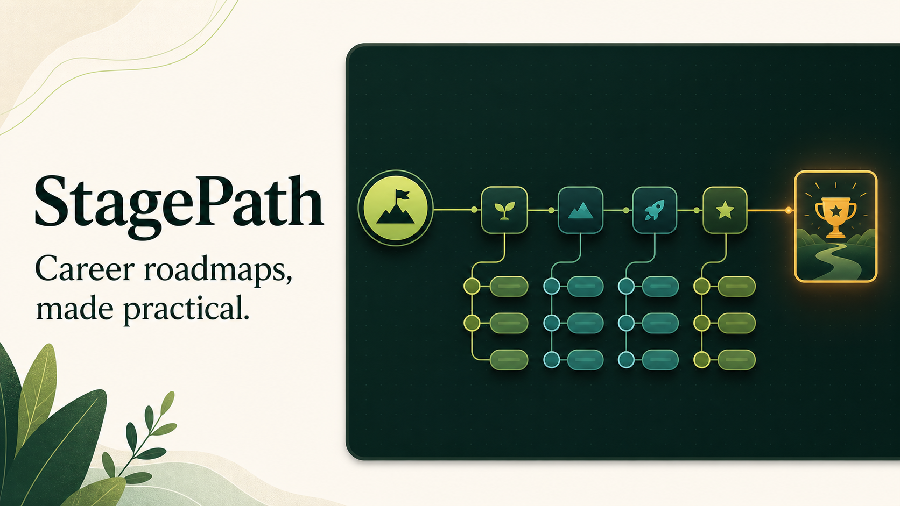

# StagePath

[](https://github.com/Ankit-Anshu/stagepath/actions/workflows/ci.yml)
[](./LICENSE)
[](https://astro.build/)
[](https://ankit-anshu.github.io/stagepath/)

StagePath turns career goals into structured, practical learning plans. Each roadmap organizes a role into ordered stages, essential skills, detailed topic notes, curated resources, assessments, and projects that help learners apply what they study.

[Explore StagePath](https://ankit-anshu.github.io/stagepath/) · [Browse roadmaps](https://ankit-anshu.github.io/stagepath/roadmaps/) · [Contribute](./CONTRIBUTING.md)



## What StagePath provides

- **Career roadmaps** that define a clear progression from foundations to job-relevant capabilities.
- **Detailed skill notes** with explanations, examples, common mistakes, practice questions, revision summaries, and interview preparation.
- **Technology curricula** for focused study of tools and foundational subjects.
- **Hands-on projects** with realistic problem statements, requirements, milestones, deliverables, and review criteria.
- **Practice datasets** for portfolio and capstone projects.
- **Curated resources** organized by topic, format, difficulty, provider, and estimated duration.
- **Connected navigation** through an interactive knowledge graph, searchable catalogs, and reusable links between roadmaps, skills, resources, and projects.

## Roadmap coverage

### Career roadmaps

- AI Engineer
- Backend Developer
- Business Analyst
- Cloud Engineering
- Cybersecurity
- Data Analyst
- Data Engineer
- Data Scientist
- Frontend Developer
- Software Engineer
- UX Designer

### Skill curricula

- Git and GitHub
- Machine Learning
- Power BI
- Python
- Spreadsheets
- SQL
- Statistics
- Tableau

### Content library

| Content type | Current coverage |
| --- | ---: |
| Career roadmaps | 11 |
| Skill curricula | 8 |
| Reusable skill topics | 300 |
| Curated resources | 46 |
| Project briefs | 16 |
| Practice datasets | 27 |
| Assessments | 3 |

## How the content connects

StagePath uses reusable content IDs instead of duplicating material across roadmaps. A career roadmap references skills; skills reference learning resources and projects; projects can include datasets and assessment criteria.

```text
Career roadmap
  └── Stage
      ├── Skill or chapter
      │   ├── Detailed learning note
      │   └── Curated resources
      ├── Assessment
      └── Project brief
          └── Dataset
```

This structure keeps shared topics consistent. For example, one SQL joins topic can support Data Analyst, Data Engineer, Backend Developer, and other roadmaps without maintaining separate copies.

## Technology

| Area | Implementation |
| --- | --- |
| Framework | [Astro 7](https://astro.build/) |
| Styling | [Tailwind CSS 4](https://tailwindcss.com/) and scoped Astro styles |
| Content | YAML collections validated with Astro content schemas |
| Markdown | [Marked](https://marked.js.org/) for detailed skill notes |
| Testing | Production build and schema validation through GitHub Actions |
| Deployment | GitHub Pages |

## Getting started

### Requirements

- Node.js 22.12 or later
- npm

### Local development

```bash
git clone https://github.com/Ankit-Anshu/stagepath.git
cd stagepath
npm install
npm run dev
```

Open [http://localhost:4321](http://localhost:4321).

### Available commands

| Command | Purpose |
| --- | --- |
| `npm run dev` | Start the local development server |
| `npm run build` | Validate content and create the production build |
| `npm run preview` | Preview the production build locally |

## Project structure

```text
stagepath/
├── content/
│   ├── assessments/    Checkpoint assessments
│   ├── chapters/       Reusable groups of related skills
│   ├── projects/       Project briefs and evaluation criteria
│   ├── resources/      Curated learning resources
│   ├── roadmaps/       Career roadmap definitions
│   └── skills/         Reusable skill topics and learning notes
├── public/
│   └── datasets/       Project datasets
├── src/
│   ├── layouts/        Shared page layouts
│   ├── lib/            Roadmap data and curriculum definitions
│   ├── pages/          Astro routes
│   ├── scripts/        Interactive knowledge graph logic
│   └── styles/         Global styles and design tokens
├── scripts/            Content-generation and maintenance utilities
└── .github/            CI, deployment, and contribution templates
```

See [ARCHITECTURE.md](./ARCHITECTURE.md) for routing, content relationships, rendering patterns, and styling conventions. Collection schemas and examples are documented in [content/README.md](./content/README.md).

## Contributing

Contributions can improve roadmap accuracy, expand topic coverage, add quality resources, create project briefs, provide reusable datasets, or enhance the interface.

Before opening a pull request:

1. Read [CONTRIBUTING.md](./CONTRIBUTING.md).
2. Follow the schema documented in the relevant `content/*/README.md` file.
3. Verify factual claims, external links, and dataset licensing.
4. Run `npm run build` and resolve validation errors.
5. Keep the pull request focused and explain its learner benefit.

For larger changes to the architecture, content model, or design system, open an issue before implementation. Project decisions and review responsibilities are described in [GOVERNANCE.md](./GOVERNANCE.md).

## Deployment

Pushes to `main` are built and deployed to GitHub Pages through [the deployment workflow](./.github/workflows/deploy.yml). Pull requests and updates to `main` run [the CI workflow](./.github/workflows/ci.yml), which verifies the production build and validates the content collections.

## Documentation

- [Contribution guide](./CONTRIBUTING.md)
- [Architecture](./ARCHITECTURE.md)
- [Content model](./content/README.md)
- [Dataset guidelines](./public/datasets/README.md)
- [Security policy](./SECURITY.md)
- [Governance](./GOVERNANCE.md)
- [Code of Conduct](./CODE_OF_CONDUCT.md)

## License

StagePath is available under the [MIT License](./LICENSE).
